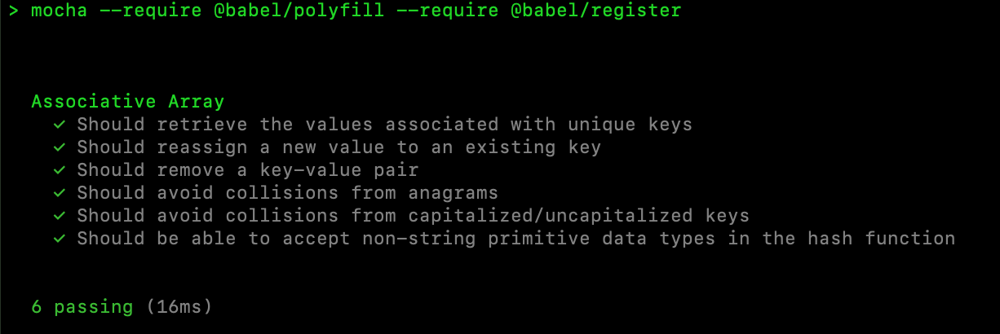
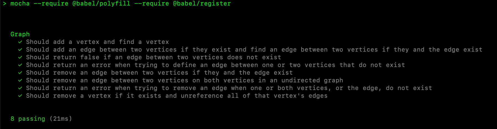

# JavaScript Data Structures
## *Test Driven Development (TDD) Of Common Data Structures In ES6*

### The following project is an In-Progress collection of common abstract data types/structures and algorithms built with ECMAScript 2015+.

I employed JavaScript, Node.js, MochaJS, and ChaiJS to build common abstract data structures. The repository will cover Associative Arrays (JavaScript Objects), Graphs, Linked Lists, Queues, Priority Queues, Stacks, Trees, and Heaps.

# Contents:
* [Associative Arrays](#associative-arrays)
* [Graphs](#graphs)
* [Linked Lists](#linked-lists)
* [Queues](#queues)
* [Priority Queues](#priority-queues)
* [Stacks](#stacks)
* [Trees](#trees)
* [Heaps](#heaps)
* [Usage](#usage)

# Associative Arrays:
An associative array (sometimes called a hash map, a hash table, a symbol table, or a dictionary) is what's behind the "object" in JavaScript. On a high level, it is an abstract data type composed of a collection of key-value pairs, such that each possible key appears at most once in the collection.

Put another way, the operations associated with this data type allow for:
* the addition of a pair to the collection - O(1)
* the removal of a pair from the collection - O(1)
* the modification of an existing pair - O(1)
* the lookup of a value associated with a particular key - O(1)
###### *Speeds expressed in average times and may vary depending on browser engine*
A JavaScript object most closely resembles an implementation of an associative array known as the hash table (hence the overlap in naming). A hash table is an array that utilizes a hash function to generate (hopefully) unique keys for any value passed into it. A good hash function is one that avoids hash collisions while not taking up too much space. As such, a proper implementation of an associative array should allow for constant time set, get, and remove operations, and therefore pass the following tests:
* Set a key-value pair without collisions √
* Get a value associated with a key after it has been set √
* Reassign the value of a key after it has been set √
* Get a new value associated with a key after it has been reassigned √
* Remove a key-value pair √
## Resources/Links:
* [Associative Array (Wikipedia)](https://en.wikipedia.org/wiki/Associative_array)
* [Hash Table (Wikipedia)](https://en.wikipedia.org/wiki/Hash_table)
* JavaScript Object Big O Performance Tests on Various Browsers [1](https://stackoverflow.com/questions/12241676/javascript-objects-as-hashes-is-the-complexity-greater-than-o1), [2](https://stackoverflow.com/questions/28329869/javascript-object-big-o)
* Polynomial string hash derived from the [Rabin-Karp algorithm](https://en.wikipedia.org/wiki/Rabin%E2%80%93Karp_algorithm)
* [Link to code](./associative-array.js)
## Tests:
## 
## Code Snippet:
 ``` javascript
export default class AssociativeArray {
    constructor () {
        this.buckets = [];
    }
    hash(key) {
        let n = key.length - 1;
        let prime = 179424691;
        let hash = Array.from(key);
        for (let i = 0; i < key.length; i++) {
            hash += (key.charCodeAt(i) * (prime ^ n)) % key.length;
            n--
        }
        return hash;
    }
}
 ```
___

# Graphs:
A graph is an abstract data type that is meant to implement the undirected graph and directed graph concepts from mathematics; specifically, the field of graph theory.

A graph data structure consists of a finite (and possibly mutable) set of vertices (also called nodes or points), together with a set of unordered pairs of these vertices for an undirected graph or a set of ordered pairs for a directed graph. These pairs are known as edges (also called links or lines), and for a directed graph are also known as arrows. The vertices may be part of the graph structure, or may be external entities represented by integer indices or references.

A graph data structure may also associate to each edge some edge value, such as a symbolic label or a numeric attribute (cost, capacity, length, etc.). [[1]](https://en.wikipedia.org/wiki/Graph_(abstract_data_type))

So what's the point of a graph? Well, a graph makes it easy to represent relationships between different types of data in the computer's memory. Think about a friend network on a social media app - it likely uses graph theory to track user's friends (vertices with edges) and give them friend suggestions (unshared edges of friends). Google Maps also uses the graph data type to represent transportation systems, and uses an algorithm to determine the shortest/fastest path between two vertices.

Like all abstract data types, graphs are constructed to perform the operations by which they are characterized. These basic operations usually include: [[1]](https://en.wikipedia.org/wiki/Graph_(abstract_data_type))
* adjacent(G, x, y): tests whether there is an edge from the vertex x to the vertex y;
* neighbors(G, x): lists all vertices y such that there is an edge from the vertex x to the vertex y;
* add_vertex(G, x): adds the vertex x, if it is not there;
* remove_vertex(G, x): removes the vertex x, if it is there;
* add_edge(G, x, y): adds the edge from the vertex x to the vertex y, if it is not there;
* remove_edge(G, x, y): removes the edge from the vertex x to the vertex y, if it is there;
* get_vertex_value(G, x): returns the value associated with the vertex x;
* set_vertex_value(G, x, v): sets the value associated with the vertex x to v.
* get_edge_value(G, x, y): returns the value associated with the edge (x, y);
* set_edge_value(G, x, y, v): sets the value associated with the edge (x, y) to v.

Where G is the Graph data structure, x and y are vertices, and v is the value of a vertex. As such, a proper implementation of a graph should allow for these operations, and therefore pass the following tests:
* Add a vertex √
* Find a vertex √
* Add an edge between vertices √
* Test whether two vertices have an edge (adjacent) √
* Find all edges of a given vertex (neighbors)
* Set a vertex value
* Get a vertex value
* Set an edge value
* Get an edge value
* Remove an edge √
* Remove a vertex √
## Resources/Links:
* [Graph (abstract data type) Wikipedia](https://en.wikipedia.org/wiki/Graph_(abstract_data_type))
* [Applications of Graph Data Structure](https://www.geeksforgeeks.org/applications-of-graph-data-structure/)
* [JavaScript Graphs](http://www.scriptonitejs.com/javascript-graphs/)
## Tests:
## 
## Code Snippet:
 ``` javascript
export default class Graph {
    constructor(isDirected = false) {
        this.vertices = {};
        this.isDirected = isDirected;
    }
    addVertex(newVertex) {
        this.vertices[newVertex] = {
            edges: {}
        };
    }
    addEdge(vertexFrom, vertexTo) {
        if (this.hasVertex(vertexFrom) && this.hasVertex(vertexTo)) {
            if (this.hasEdge(vertexFrom, vertexTo)) {
                throw new Error("This edge has already been defined");
            } else {
                if (this.isDirected) {
                    this.vertices[vertexFrom].edges[vertexTo] = true;
                } else {
                    this.vertices[vertexFrom].edges[vertexTo] =
                    this.vertices[vertexTo].edges[vertexFrom] = true;
                }
            }
        } else {
            throw new Error("One or both of these vertices do not exist in the graph");
        }
    }
}
 ```

# Linked Lists:

* 

## 

 ``` javascript
class LinkedList {
    constructor () {

    }
}
module.exports = {
    LinkedList: LinkedList
}
 ```

# Queues:

* 

## 

 ``` javascript
class Queue {
    constructor () {

    }
}
module.exports = {
    Queue: Queue
}
 ```

# Priority Queues:

* 

## 

 ``` javascript
class PriorityQueue {
    constructor () {

    }
}
module.exports = {
    PriorityQueue: PriorityQueue
}
 ```

# Stacks:

* 

## 

 ``` javascript
class Stack {
    constructor () {

    }
}
module.exports = {
    Stack: Stack
}
 ```

# Trees:

* 

## 

 ``` javascript
class Tree {
    constructor () {

    }
}
module.exports = {
    Tree: Tree
}
 ```

# Heaps:

* 

## 

 ``` javascript
class Heap {
    constructor () {

    }
}
module.exports = {
    Heap: Heap
}
 ```

# Usage:

* Install the latest version of Node.js onto your machine, available [here](https://nodejs.org/)
* Clone this repository to the filepath of your choice on your local drive.
* Install the dependencies listed in the package.json file by typing ```npm i``` into the shell of your choice
* Execute ```npm run test``` in the shell to see the results of each data structure constructed

Thank you for reading!

### Built With:
* JavaScript
* Node.js
* Babel
* Mocha
* Chai
* GitHub